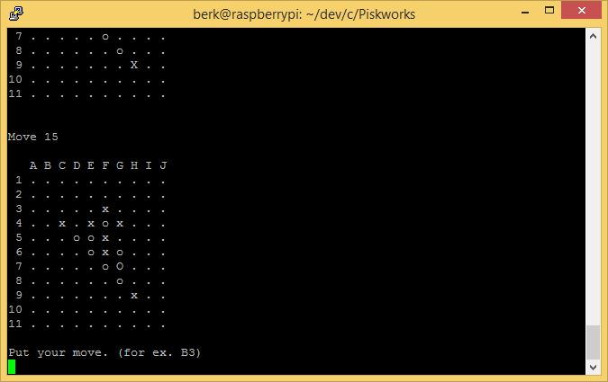
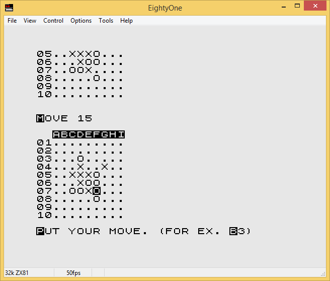
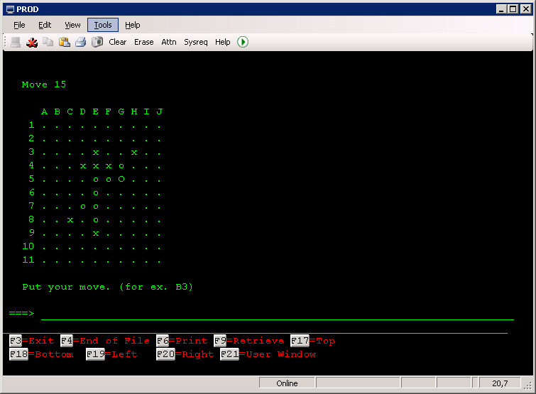
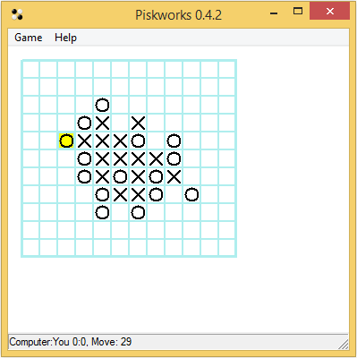

# Piskworks
Piskworks is a simple desk game known as gomoku.

## Supported platforms

### UNIX, Linux, MS Windows console:
  1. download project `git clone https://github.com/berk76/piskworks Piskworks`
  1. go into project directory `cd Piskworks`
  1. run `make -f Makefile.gcc pisk_con`
  1. find and run pisk_con.exe

  

### DOS
  1. download and install Turbo C from http://edn.embarcadero.com/article/20841
  1. download project `git clone https://github.com/berk76/piskworks Piskworks`
  1. go into Piskworks/src directory 
  1. run `make -fMakefile.tc`
  1. find and run main_con.exe

### ZX Spectrum
  1. download and install Z88DK c compiler from http://www.z88dk.org
  1. download project `git clone https://github.com/berk76/piskworks Piskworks`
  1. go into project directory `cd Piskworks`
  1. run `make -f Makefile.z88dk pisk_zx`
  1. find and load pisk_zx.tap

### ZX81
  1. download and install Z88DK c compiler from http://www.z88dk.org
  1. download project `git clone https://github.com/berk76/piskworks Piskworks`
  1. go into project directory `cd Piskworks`
  1. run `make -f Makefile.z88dk pisk_81`
  1. find and load pisk_81.P
#### If you want to make autorun
  1. load pisk_81.P in EightyOne emulator
  1. add following lines:
     1. `9990 SAVE "PISKWORKS"`
     1. `9995 GOTO 0`
  1. type and run command `RUN 9990`
  1. open Tools/Tape Manager...
  1. delete the first entry
  1. push save button

  

### ZX80
  1. download and install Z88DK c compiler from http://www.z88dk.org
  1. download project `git clone https://github.com/berk76/piskworks Piskworks`
  1. go into project directory `cd Piskworks`
  1. run `make -f Makefile.z88dk pisk_80`
  1. find and load pisk_80.O

### APPLE 1 (replica 1)
  1. install c compiler according to this article: http://jefftranter.blogspot.cz/2012/04/c-programming-tutorial-with-cc65-on.html
  1. download project `git clone https://github.com/berk76/piskworks Piskworks`
  1. go into Piskworks/src directory
  1. run `make -f Makefile.app`
  1. run `bintomon -v -f pisk_app > pisk_app.mon`

### AS400
  1. download project `git clone https://github.com/berk76/piskworks Piskworks`
  1. go to src `cd src`
  1. run `./crtgom.sh` it will produce source file for as400 `qcsrc.gom`
  1. get into as400 and create your personal library if you dont have one `crtlib mylib`
  1. setup your private library as default library `chgprf curlib(mylib)`
  1. create new file QCSRC `crtsrcpf mylib/qcsrc`
  1. copy new member GOM (from src/qcsrc.gom) into QCSRC file using FTP client.
  1. you can see and modify source code in SEU editor `strseu srcfile(QCSRC) srcmbr(GOM)`
  1. compile program using crtbndc command `crtbndc pgm(GOM) output(*PRINT)`
  1. finally you can run program `call GOM`

  

### MS Windows
  1. download and install MinGw from http://www.mingw.org/
  1. download project `git clone https://github.com/berk76/piskworks Piskworks`
  1. go into project directory `cd Piskworks`
  1. run `make -f Makefile.gcc pisk_w32`
  1. find and run pisk_w32.exe

  
